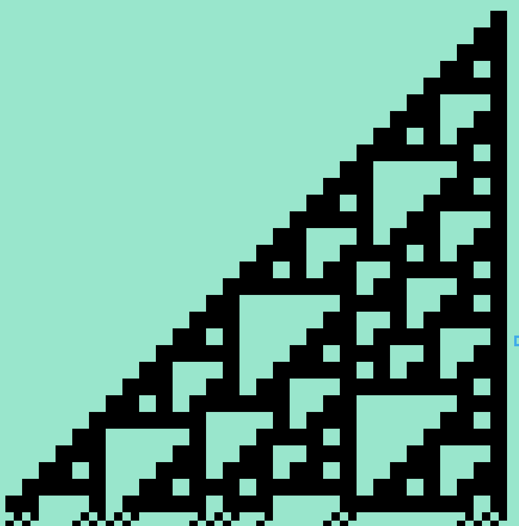

> [!IMPORTANT]
> This is an early work-in-progress!


## Getting started

### Requirements

1. Install [LÖVE][love2d]
2. Clone this repo locally
3. See [this wiki](https://love2d.org/wiki/Getting_Started) for platform-specific launch instructions

Once you've figured out your launch command, try running the project. It should open two windows:

1. A console which logs basic info during run
2. The application window

[love2d]: https://love2d.org/

### Preparing the Example Files

Copy the files from the `example` folder to the root of this repo:

```
cp example/*.png .
```

They do the following:

| File              | Purpose                                      |
|-------------------|----------------------------------------------|
| `source.png`      | Initial board state as black & white pixels. |
| `rules.png`       | The rewriting rules used each step           |
| `symbols.png`     | The symbol patterns (see below)              |

### Running

Launch the project. For example, if you are on Linux and using the appimage version of [LÖVE][love2d], you might do the following:

```
love-11.5-x86_64.AppImage .
```

The example `rules.png` and `source.png` currently produce a graphic like this:



### Basic Controls

* The arrow keys provide input while running
* The space bar toggles pause
* The `R` key reloads the intial state
* The escape key quits

Controls are listed in greater depth in the [Controls](#controls) section below.

## Usage


### Initial Board State

The initial board state will be loaded from `source.png`.

The image should contain only grayscale pixels (zero saturation / chroma):

* Black or white pixels are read as their literal value
* Grays will be converted to either black or white with a 50-50 chance each run

### Rules

The rules are parsed from `rules.png`.
Use an image editor/ pixel art software to edit the rules.

Each rule replaces the pattern on the left with the one(s) on the right as follows:

1. Pixels with any color saturation (chroma) are ignored and can be used as comments
2. Patterns of black and white pixels are used to search the board and replace matching areas
3. Gray pixels are wildcards
4. A rule needs at least two patterns: where the left is found, it is replaced with the right 
5. Multiple options on the right of a pattern will be chosen from at random

Rules are arranged in rows and read from left to right like text.
* Gaps of any width that contain no grayscale pixels separate a rule into patterns
* Gaps of any height that contain no grayscale pixels separate rules from other rules

#### Advanced Rules

Special patterns (symbols or "keywords" as described next section) modify the rule they are in. 
A rule can contain multiple search patterns and replacements, where all have to match at once.
The parser groups patterns and special symbols in a rule based on their dimensions.

For example, a rule that changes A to B, and C to D, where all of these patterns are 5 x 5 pixels, can look like this:

```
..#.. ####.   .###. ####. 
.#.#. #...#   #...# #...#
#...# ####. # #.... #...#
##### #...#   #...# #...#
#...# ####.   .###. ####. 
```

The single pixel in between acts as a spacer, otherwise the rule would replace A with B, C or D at random.

### Symbols

Single patterns (no 'right side'/ replacement patterns provided) are either ignored or parsed as a "keyword". You can decide what the keywords look like.
The graphics for each "keyword" below will be loaded from `symbols.png`, starting from the top of the image. The keywords will be loaded in descending order as shown below:

| Keyword         | Action                                          |
|-----------------|-------------------------------------------------|
| Rotate          | Create all 4 rotations for the rest of the rule |
| Flip horizontal | Creates both versions                           |
| Flip vertical   | Creates both versions                           |
| Lock to grid    | *Currently not supported*                       |
| Input right     | Matches user input of the right arrow           |
| Input down      | Matches user input of the down arrow            |
| Input left      | Matches user input of the left arrow            |
| Input up        | Matches user input of the up arrow              |

The rotate and flip keywords apply to the rest of the rule, as it is being parsed, and expand one rule into multiple (for each direction).
Because the patterns to the right are not parsed at that point, a keyword can modify any pattern to its right that is actually meant to be another keyword!

For this reason, I recommend making the rotate symbol itself rotationally symmetrical and immune to flipping.
I also recommend making the flip keywords immune to flipping, so you can combine these keywords in any order.
To make a moving player with a single rule, you can prefix it with the rotate keyword followed by one of the input keywords, assuming those use the same rotated pattern!


## Controls

### Basics

| Action     | Mouse / Key        | Details                                                  |
|------------|--------------------|----------------------------------------------------------|
| Quit       | Escape key         | Quit the application                                     |
| Pause      | Space bar          | Pause or unpause the update loop                         |
| Input      | Arrow keys         | Rules with matching input keywords will match for 1 turn |

### Programs & Boards

| Action     | Mouse / Key        | Details                                                                      |
|------------|--------------------|------------------------------------------------------------------------------|
| Load       | `L` Key            | Load the board data from disk                                                |
| Draw       | Left / Right Mouse | Click to draw single pixels, drag for rectangles.                            |
| Reset      | `R` Key            | Reset the image in the project folder                                        |
| Save       | `S` Key            | Save the board to the LÖVE [appdata folder][][^1] (overwrites existing file) | 

### Views & Visualization

| Action        | Mouse / Key        | Details                                        |
|---------------|--------------------|------------------------------------------------|
| Zoom          | Mouse wheel        | Changes the pixel and Window size              |
| Cycle view    | `Tab` key          | Toggle between viewing rules and the board[^2] |
| Visualization | `1` / `2`          | Decrement / increment heatmap visualizations   |

#### Heatmap Visualizations

The heatmap visualizations wrap around at the start / end.

* All heatmap visualizations other than the last show rewrites using each rule since last player input
* The last shows where rules apply in real-time. 

[^1]: The program will also try to read from any `settings.lua` in the appdatqa folder. Toggle the `logRules` setting if you want to see how rules are parsed in the console. It uses `$$` for white, `[]` for black, `..` for wildcard and single `;` to separate rewrites in the same rule.

[^2]: The rules view is currently incomplete and will be interactive later.

[appdata folder]: https://love2d.org/wiki/love.filesystem


